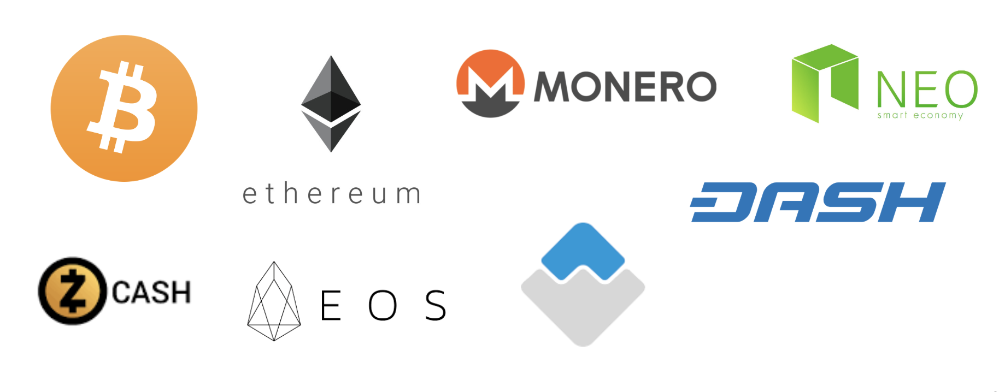

# Reporting

## **User Management**

### **List of user with details**

As a Staff User you have access to view the list of registered users

You can use search field or select the user from the list to view details.

Click on user to see more. You are able to see user's personal info \(password is encrypted for security reasons\)

Also there are available to view user's permissions and date of joining. Regular user authomaticaly has Active status and doesn't have access to the Admin panel

### **Enable KYC**

You have access to change users' KYC information

Select Corporate or Individual KYC

Select or search for user. There are some information about users that is encrypted.

For Corporate KYC: Business name, Business address, Incorporation number, Business registration document, Shareholders registry document are encrypted.

For Individual KYC: First name, Last name, Document image, Selfie image, Cryptocurrency address are encrypted.

You are able to change user's KYC information and the status. In Admin panel KYC status changes authomaticaly according to Artemis status changing, documents and photos uploading.

Note: You receive KYC accepted/rejected emails only in case of changing KYC status on Artemis.

### **Referrals**

To review information about referral program and referrals find Referrals tab in Admin panel

Find in Referral levels how many percent user will get for each referral transaction \(in decimal\)

Select Referral programs to see more information.

Min to withdraw means the minimal number of referral tokens is needed on user's balance to be able to withdraw them.

Select Referrals from the list to view referrals and their referrers. Referrer receives percent from his referrals.

### **Retrieve referrer email**

To retrieve referrer email open Retrieve in Referrals tab in the new admin panel and enter an Invite code from referral link

### **Transactions**

You have access to all information about user's transactions

Select Transaction applies to view details about every transaction \(Eth, Btc, Nem, ShapeShift, Claim Tokens\)

You can copy transaction hash and find even more details in Bitcoin transaction details, Ethereum contracts logs and Shape shift orders paragraphs, according to currency of copied transaction address

### **Tokens Allocation Request**

If User wants to make USD transaction he has to send payed invoice and according the invoice Admin has to send him his tokens from Admin panel.

To make Bank wire transaction Admin should select Tokens allocation request in Transactions section and press Add

Select an email address the user has registered with, enter amount of tokens to send him, select crowdsale stage, \(**Note:** Leave Status field with pending option\) and press Save button.

## **Withdraw BTC**

To withdraw Btc follow these next steps:

1. On Django admin panel open Authorized btc address

2. Press Add and enter  title and btc address of receiver. Save it.

3. Go to **new admin panel** and log in with the same credentials that you used to log in to Django admin

4. From side menu select Withdraw btc in Btc node section

5. Select a previously added Btc address, enter amount of Btc to withdraw

6. Enter passphrase and press Withdraw. This transaction will be displayed below.

Open Btc wallet settings and Save a new pass phrase. 

## Localization

To make changes in translations select Translate in Localization tab. Choose language from drop-down menu and press the button.

