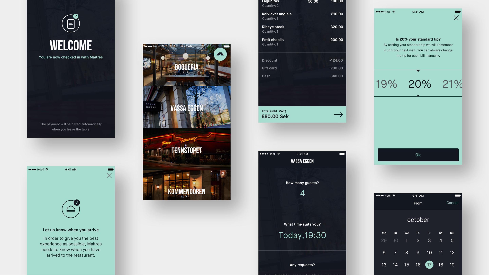

# Maitres

The smart restaurant booking platform in Sweden and integrated with 25 the most popular Swedish restaurants \(more on [https://www.maitres.com/restaurants](https://www.maitres.com/restaurants)\) The app was also integrated with the several payment gateways and allows for the corporate users to generate invoices. The users can easily find the restaurant, book online, pay via the app for the bill and rate. The app also allows the owners of the restaurants to increase the revenue and enhance the dining experience.

4ire Labs is responsible for iOS and backend development, tech support. The project is on-going and we started the project in August 2018.

The app was released into production in 2018. Check out and test [https://itunes.apple.com/se/app/ma%C3%AEtres/id1211656820?mt=8](https://itunes.apple.com/se/app/maîtres/id1211656820?mt=8)

iOS and backend development, tech support.

Technologies: 

Backend: Go 

Native mobile development: Swift 

Video explanation on [https://www.facebook.com/maitresdining/videos/2431530593545586/](https://www.facebook.com/maitresdining/videos/2431530593545586/)

Team Lead: [Oleg Bugrovoy](../about/oleg-bugrovoy.md) 

Team composition:

Tech Lead, Backend Engineer, iOS Engineer, Q/A

