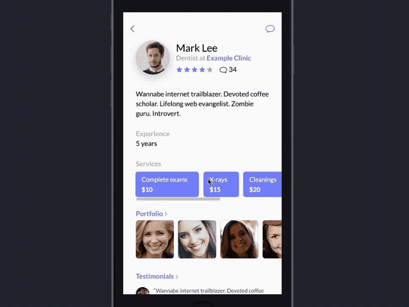
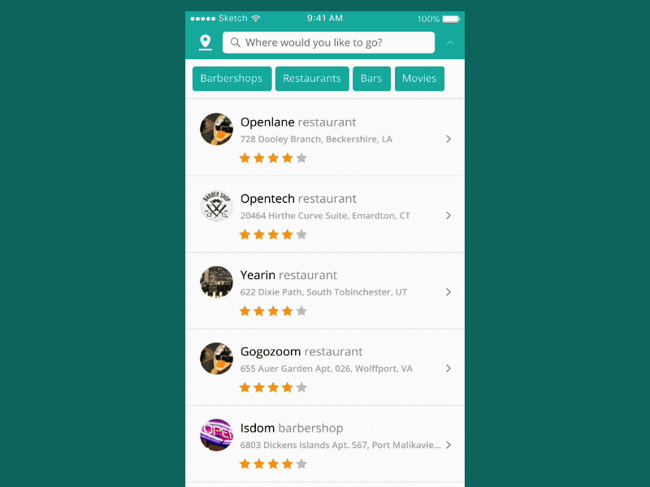

# Dapps / Wallets Development

We offer full-cycle development \(BA, UX, PM, Development, QA, DevOps\) for fintech, e-commerce and other Apps and Dapps.

**Case Studies:** [Kidcoin](case-studies/kidcoin.md), [Kepler Collective](case-studies/kepler-collective.md), [Social. Media Market](case-studies/social.-media-market.md), [Smart Documents](case-studies/notarization-platform.md), [ORME](case-studies/orme.md)

**Consultants:** [Kirill Kirikov](org-1/kirill-kirikov.md), [Oleg Bugrovoy](org-1/oleg-bugrovoy.md), [Bohdan Malkevych](org-1/bohdan-malkevych.md)

## Design

We design web, mobile experiences, including web3/blockchain. Current portfolio is on [behance](https://www.behance.net/4irelabs) and [dribble](https://dribbble.com/4irelabs).

Some examples:

## Tech Stack

**Blockchain:** web3 js / py, ethereum, ethermint, tendermint, bitcoin, dash, shapeshift, truffle, testrpc, zeppelin-solidity, solidity, mocha, go, quorum, hyperedger burrow, hyperledger sawtooth lake, hyperledger fabric, NEO, infura

**Backend:** python 3, pipenv, django, celery, jwt, django rest framework, postgres, redis, boto3

**Front-end:** Vue.js, SASS / CSS, Webpack, eslint, ES 6

**Mobile:** iOS \(Swift, Objective C\), Android \(Java, Kotlin\), PWA

**Infrastructure:** prometheus, logstash, kibana, elastic search, grafana, docker, kubernetes, helm, teamcity, nginx, aws, linux

## Process

### 1. Preliminary Analysis

2-5 presale calls with tech leads, superficial examination of the project.

Deliverables: Suggestions on the overall expediency of the project, price and timeframe assessment

Duration: ~1 week

### 2. Discovery Phase

Deep dive into the project, industry analysis, specifications development.

1. Architectural Analysis \(AA\) defines the problems an architecture must solve. The outcome of this activity is a set of architecturally significant requirements \(ASRs\).
2. Architectural Synthesis \(AS\) proposes candidate architecture solutions to address the ASRs collected in AA, thus this activity moves from the problem to the solution space.
3. Architectural Evaluation \(AE\) ensures that the architectural design decisions made are the right ones, and the candidate architectural solutions proposed in AS are measured against the ASRs collected in AA.
4. Architectural Implementation \(AI\) realizes the architecture by creating a detailed design.
5. Architectural Maintenance and Evolution \(AME\) is to change an architecture for the purpose of fixing faults and architectural evolution is to respond to new requirements at the architectural level

Deliverables: Roadmap, user stories, UML diagrams, solution architecture documentation, project plan, detailed price assessment

Duration: 1-3 weeks

### 3. MVP Development

Team forming, engineering

Deliverables: Source code, API documentation, software betа

Duration: 1-4 months

### 4. Refinement & Support

Testing, debugging, optimization, problem solving

Deliverables: Fully operational software, 24/7 support

Duration: continuous

