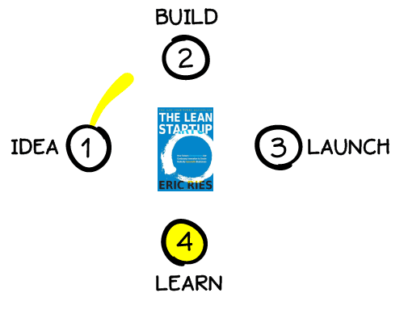

# Design Sprint

## Who uses it and when?

* startup founders – for faster product validation
* product managers – for innovation and improvements in the existent product \(like new features or side products\)

### Product Manager Journey

### Problems with the usual approach

* Cross functional teams find it hard to align with common business objectives
* Teams often work towards unclear goals as project scope changes repeatedly
* Teams lack real data on which to base business decisions, instead relying on endless internal discussions
* Product development cycles run too long, causing teams to lose enthusiasm and focus.

### So how might we...

* Create more more and better ideas
* Enable deeper understanding, engagement and alignment with the team
* Get real data and learn faster

## How is Design Sprint solving it?

Check this 5 minutes intro video:



### Principles

* Together Alone – optimal combination of collective intelligence and deep individual work
* Tangible Discussion – faster and more clear decision making
* Don't rely on creativity – using tested methods for mass solution ideation

### Process

### Team Composition

You must have the decision maker and a facilitator in the sprint. Besides that you can include the people with expertises you can use in the product: designers, engineers, marketers etc. Optimal composition is 5-7 people, but there's no restriction to have more or less. What's **crucial – is to have at least one subject expert** who understands the problem we're trying to solve.

## Can it help my product?

Contact us through the chat here or via email [ms@4irelabs.com](mailto:ms@4irelabs.com) \(Max\) and let's have a chat to see how it can fit your product or idea.

## Publications

* [Improving the crypto wallet authorization experience with security level selector](https://medium.com/practical-blockchain/improving-the-crypto-wallet-authorization-experience-with-security-level-selector-85dfa2a567b3)
* [Short story of wrong product, usability testing and Userbrain](https://blog.seductive-mobile.com/short-story-of-wrong-product-usability-testing-and-userbrain-a490053893f9)

