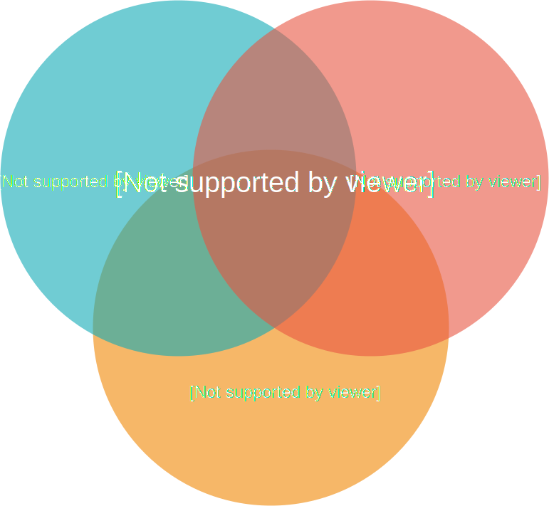

# Merging.Space Overview

## Problems 

* Develop the idea without money
* Investing in a project without money and get transparent revenue from it
* Take part in only interesting projects and do tasks only you want to do

## Goal 

Help inventors fast and efficient to start developing an idea / granted project without thinking of hiring and managing a high-cost teams. Give access to everyone to take part in granted projects, so give ability to invest everyone in developing open-source products and receiving transparent revenue for work.

## Solution Today 

### Incubators 

Nowadays we have a lot of incubation programs all over the world where people combine their efforts to grow an idea from paper to production with minimal investing money in it. Sounds good, let's describe the process how ideas becomes projects and how incubators helps to do that.

Most incubators are paid but there are free too. Some have post-payment feature, some take constant amount of money to have ability to develop own project in that incubator.

On the first stage, you must initiate your own group of like-minded team. In case when you have only idea you can find your team during this stage. You met participants, describe your idea, make attempts to get interested more participants.  

On the other hands, when the project is done. During pitching about the developed product, founder has several minutes to get that angel investor who will invest in the start-up.

So, how many participants somebody can invite to take part in developing the project, and how many agreed developers will see the project as inventor can see?

How many angel investors can look at the developed work at the pitching day?

In the best case answer can be: "As much as a room admits"

### GITCOIN 

TODO

## Solution Tomorrow \| Merging.Space 

### How it works? 

Nowadays, it is very convenient to use online SaaS solutions. Such applications are often updated more frequently than traditional software cause they are hosted centrally and no any blockers to prevent improving the platform.

There are 3 types of consumers on this platform.

* Idea holders. It can be a one person or a whole team. 
* Executer. The person who will commit finished tasks.
* Investors

On the platform users can create projects. Describe the main idea of their startups and fill backlog with tasks. To get involved more and more executers, founders provide information about the idea, the purpose, describe milestones and introduce existing team in any convenient way: text description, photo and video materials, links to prototypes and so on.

Executors can view dashboard \(jira-like\) of a project and do tasks that is most attractive for them. There are a lot of advantages of such approach. First of all, it is displaying the real state of the project tasks and the project at all. Everybody can monitors what tasks are in process, who does / did it, when it was started and full discussion inside the task. Another one is about transparency of calculating the percentage of owning a project. After finishing a task, executor moves task from "In progress" column to "In QA review". 

* If the task is programming, the developer must create pull request, so the act of accepting implemented task \(moving task to "done" column\) will be merging the pull request to the dev branch.
* If the task is design / research etc, the act of accepting task will be moving task to "done" column by any of existing team menber.

So the system will automatically recalculate percentage of project ownership after the task will be moved from "in progress" to "done".  It brings more transparency to all processes therefore increase trust to projects which listed on the Merging.Space platform.

### Improvement P2P Economy 

TODO

### DAO instrument of decision 

TODO

