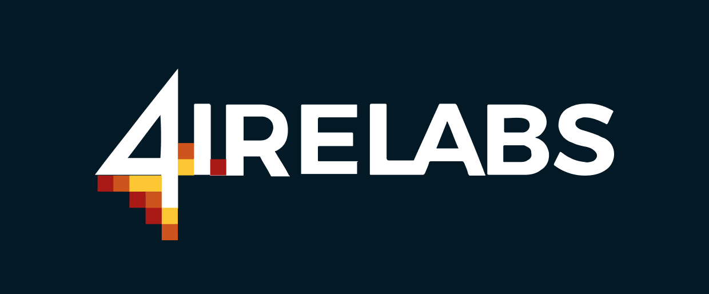
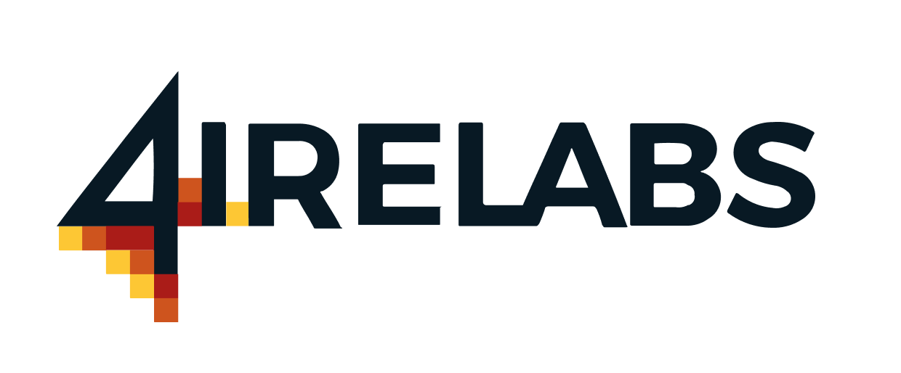

# Brand / Community

На квадратики 4ire - эффект огня?

[style guide](https://www.figma.com/file/TBaNlFwSZ3i9mB7UdN1wCD44/4IRE-Style-Guide)


* крутой профиль, достижения
* для каждого страничка, промоутить спикеров на конфы и митапы, делать классные кейс стади и тд. У каждого свой бренд и бизнес.
* Начать делать твиты про сотрудников и мб неделю им вести - вообще всех людей 4ire
* Давать коллегам вести соц сети


### Ассоциации

* Дорого
* Качественно
* Финтех
* веб3
* Лампово
* Impactful
* Innovation
* Expertise
* Labs
* Развитие
* Быстро
* Lean
* Design Thinking
* В поиске

Таски?

* ассоиация с финтех инновейшен и дизайн синкинг
* для Nordic стран
* Поработать с креативным агентством \(через SPOM?\)

Больше общаться с компанией, регулярные тусовки и обмен смыслами


* Проводить общие тусовки
* Кофе
* Праздновать дни рождения
* Human Resource Person in 4ire \(Stas?\)
* Подарок от компании как рефлексия
* Креативное пространство
* Использовать внешние стены для всяких опросов


