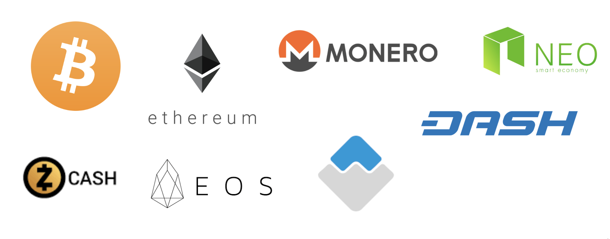

# Blockchain for Enterprise

### Blockchain = Database + Network

1. Transparent
2. Immutable
3. Distributed
4. Encrypted
5. Redundant

### Blockchain Economy

* Consensus
* Mining and fees
* Assets \(coins, tokens and else\)
* Network effect

### Benefits for Enterprise

* Reduce costs with automation
* Decrease risks with better data
* Improve customer service through trust and transparency
* Power up new products and channels

### Use case conditions

* Involves multiple parties
* Involves new intermediaries
* No need for a central trusted authority for executing various transactions
* Accurate record of the date and time of each transaction needs to be captured
* Retroactive manipulation of data is not encouraged
* Multiple uses of the same data is possible by different stakeholders

### Public Permissionless

* Undefined legal status
* Reputation in regards to unlawful uses  \(e.g. ML, black market\)
* Hacks and scams
* Scaling
* Volatility of rates and fees

### **Private / Permissioned**

For Consortia / Government Uses

### Hybrid \(semi-public\)

### Example: Escrow

1. Buyer wants to purchase goods or services
2. He sends the deposit to the escrow SC \(multisig wallet with 3 parties\)
3. Seller sees that escrowed is filled and starts the service
4. On delivery
   1. Buyer can release the fund
   2. Or seller can cancel and release the funds back
   3. Or attract 3rd party is attracted for the conflict resolution, which can release funds to either party and take fee out of the sum

