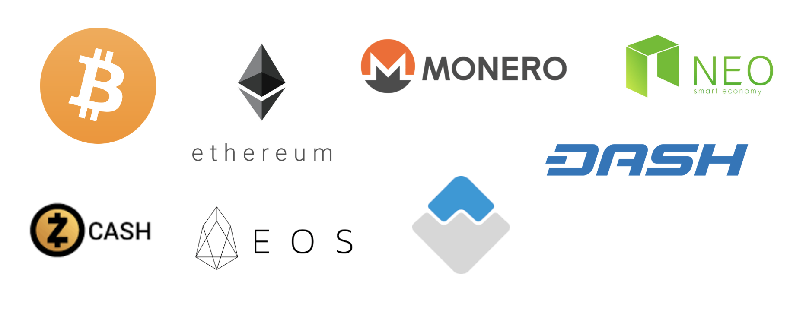

# Blockchain for Insurance

## Blockchain overview

### Blockchain = Database + Network

1. Transparent
2. Immutable
3. Distributed
4. Encrypted
5. Redundant

### Blockchain Economy

* Consensus
* Mining and fees
* Assets \(coins, tokens and else\)
* Network effect

### Benefits for Enterprise

* Reduce costs with automation
* Decrease risks with better data
* Improve customer service through trust and transparency
* Power up new products and channels

### Use case conditions

* Involves multiple parties
* Involves new intermediaries
* No need for a central trusted authority for executing various transactions
* Accurate record of the date and time of each transaction needs to be captured
* Retroactive manipulation of data is not encouraged
* Multiple uses of the same data is possible by different stakeholders

### Public Permissionless

* Undefined legal status
* Reputation in regards to unlawful uses  \(e.g. ML, black market\)
* Hacks and scams
* Scaling
* Volatility of rates and fees

### **Private / Permissioned**

For Consortia / Government Uses

### Hybrid \(semi-public\)

### Example: Escrow

1. Buyer wants to purchase goods or services
2. He sends the deposit to the escrow SC \(multisig wallet with 3 parties\)
3. Seller sees that escrowed is filled and starts the service
4. On delivery
   1. Buyer can release the fund
   2. Or seller can cancel and release the funds back
   3. Or attract 3rd party is attracted for the conflict resolution, which can release funds to either party and take fee out of the sum

## Blockchain Insurance Use Cases

### Case Management \(now\)

### Case Management \(with blockchain\)

### Comparison

### Benefits

* Simplified and / or automated claim submission
* Enhanced customer experience
* Automated claim processing
* Reduction in fraudulent claims
* Integrated data resources
* Streamlined payment process

### Approach

1. POC for internal processes
2. Customer-facing processes
3. IoT enablement

## Blockchain Insurance Case Studies

### Case: Catastrophe Swaps and Bonds

### Cross-insurance interaction

A blockchain ledger could provide insight and notification if one of those reinsurers then tried to offload some of its portion to a subsidiary of the other reinsurer. It also would help insurers gain confidence that, as they pay out claims, they are appropriately rebalancing their capital exposures against specific risks.

At minimum, global insurers can use blockchain to cut asset management costs by reducing the hedging fees they pay to protect themselves from currency fluctuations in international transactions.

> B3i Services AG’s purpose is to provide insurance solutions on a blockchain platform that substantially improves efficiency across the value chain of the re/insurance industry — in some cases up to 30 percent, said B3i Services in a statement.

### **Case: Asset Registries and Data Provenance**

Global, digital ledger that provides audit trail for valuable assets throughout their lifetime journey. This digital incarnation, or thumbprint, is used by various stakeholders across a supply chain pipeline to form provenance and verify authenticity.

Started with diamonds. Can be used for tokenized assets \(like real estate\).

### **Case: Onboarding / KYC**

Use blockchain for onboarding of new customers or verification of policy holders identity. ****Brings reduced admin cost and speed-up process for onboarding.

### **Case: Flight Delay Insurance**

Automatic compensation for flight delays

### **Case: Insurance with IOT / sensors**

* Medical sensors data \(ambiotex\)
* Agriculture

Can be used for:

Smart contracts can automate certain aspects of insurance contracts, driven by cognitive services and trusted Internet of Things \(IoT\) data feeds. E.g. Vehicle insurance costs can differ on the performance of the driver.

### **Case: real-time insurance for the sharing economy**

The emergence of the sharing economy, exemplified by companies such as Uber and Airbnb, has created the opportunity for new, dynamic insurance products that address the challenges inherent in leveraging personal assets for commercial purposes.

### **Case: Underwriting**

Non-underwritten products—tightly integrated with the blockchain for policy administration, claim handling, and ultimately payment—reduce overheads at nearly every point in an insurance company’s operations, resulting in the potential for significant margin growth in even the most mature markets.  
  

###  

